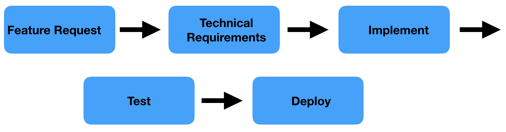
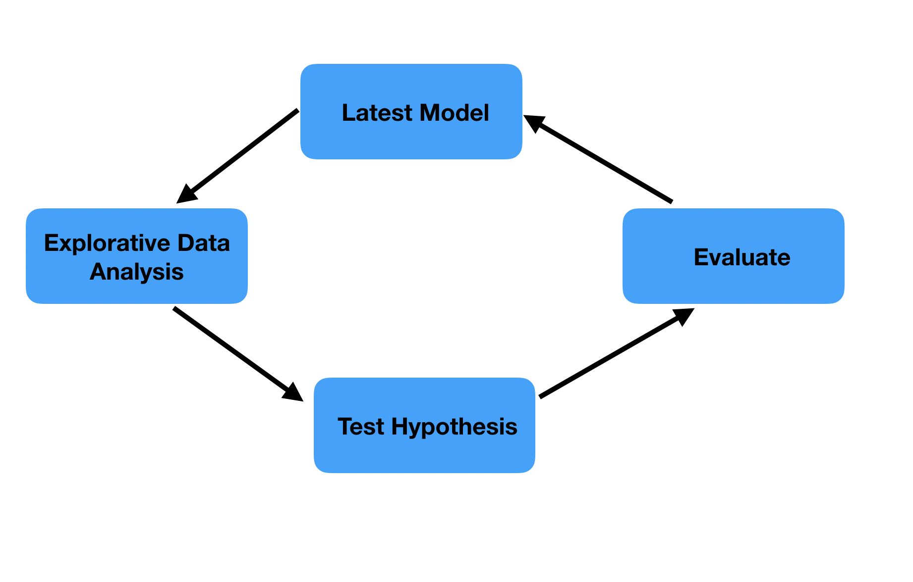

# A Methodology for Agile Machine Learning: Tasks

Now we have interpreted the Twelve Agile Principles in the Agile setting we can explore what an Agile machine learning workflow might look like. Let us remind ourselves that the workflow is always a means to an end. The Agile values and principles are the guidelines and the workflow should serve following the principles the best you can. If at any moment in a project the team feels the workflow is no longer the optimal way to make decisions in an Agile way, it should change it. Therefore, this chapter should be considered as nothing more than an exploration, a bunch of thoughts. If it does not work for you for whatever reason, by all means find a better way.

## Linear and Circular Tasks

The tasks in Agile software development are what I call linear tasks. They come from feature requets by stakeholders to the product, collected by the product owner. The outcome is envisioned and captured in a user story. The team translates it into the technical tasks and starts working on it. Both Scrum and Kanban do not prescribe the steps a task should go through, but it typically looks like the following.

```{r, echo=FALSE, fig.cap="Linear flow in software development"}

```

These type of tasks lend themselves well for scoping and committing oneself to what the product will look like in a few weeks time, as is done in Scrum. Machine learning tasks to improve a model are what I call circular tasks. The starting position is the latest version of the model. If one has not yet a good idea how to further improve the model we would typically do an explorative analysis. From this a hypothesis can be generated of how the model might be improved, which is subsequently tested. Next we can evaluate if we want to change the model based on the hypothesis tested. If so we update the model, if not we start a new cycle.

```{r, echo=FALSE,  fig.cap="Circular flow in machine learning"}

```

Machine learning projects typically also encompass linear tasks, such as setting up a pipeline to import the data and do basic data wrangling or exposing the model results in an API. However, the circular nature of the modelling part of the project makes the highly structured Scrum method unfit for machine learning. We simply cannot guarantee that the model will be updated in two weeks time, because we don't know if the hypotheses we are going to test will give us anything that will improve the model. Moreover, during the completion of a task we can generate new hypotheses that seem more relevant than the one we originally had scheduled to do after this task. If we had commited to a set of tasks for a fixed time period from which we cannot deviate, we are slowed down because we cannot directly act on newly gained insights. The flow oriented Kanban seems a better fit for machine learning projects because, just as software service teams, the most relevant thing to do next often changes at the last moment. 

## A Two-Way Model for Development

With presenting the circular workflow of machine learning I got a little bit ahead of myself, it asumes that we work with a two-way structure that is presented here. This workflow makes a hard cut between the *model pipeline* and *exploratory research*. The latter always contains the best possible model we can build based on our current knowledge. It is standalone, which means that it contains all the steps to go from source data to exposing the predictions. It should be high quality software so we can rely on it. This will make the model completely reproducible and automatable, the two requirements for continuous delivery of model results. In order to improve our model we do exploratory research, which can be anything that the machine learning researcher can think of. Exploratory research will greatly benefit from having an organised model pipeline, because it will make intermediate results on which to explore quickly available. In order to test hypotheses quickly, exploration scripts can be interactive analyses without software requirements or even being reproducible in later stages. They should quickly give an indication if the model can be improved by the alteration propesed by the hypothesis. 

## User Stories

In both Scrum and Kanban the tasks ahead are formulated in user stories, clearly stating what the benefit of the customer will be once the user story is completed. This will retain focus on delivering customer value with everything you do. Also the work in a large machine learning project can be chunked up, but it is sometimes difficult and often futile to formulate the task ahead in the shape of user stories. In software development there is an abundance of ways to change the product as it currently is. We could leave everything the way it is, but change this one little thing that will improve user experience. Say, giving one extra option at a dropdown or siging up for a news letter. In machine learning the final product is just a bunch of predictions and the many options you have to improve the model will almost all have the goal of improving those predictions. If you try to define a user story it will always go "As the <user of the model> I want to have the best possible preditctions, such that <application of the model>". It does make sense, though, to create an overarching user story for the entire project. This will enforce the team and the stakeholders to think of the application of the model. All too often machine learning projects are initiated with an explorative nature, to "see if there is anything in the data". If the group does not manage to formulate a proper user story for the project, there is probably no good application for the model and you should not start exploring in the first place. 

## Using Kanban for Machine Learning

We have concluded that Scrum is too rigid for machine learning because the explorative nature of data analysis is not suitable for the tight planning of deliverables in Scrum. Kanban on the other hand gives us the flexibility to change the next task we are taken upon ourselves. Within a two-way model for doing machine learning there is the model pipeline that has to be good quality and there is the explorative research in which you can do whatever to come to quick conclusions about the hypothesis tested. It appears that the linear tasks of software design are a match with the model pipeline, whereas the circular tasks are applicable to the exploratory research. Weaving these finds together results in a Kanban workflow with at least the columns *to do*, *doing*, and *done*. Hypotheses to be tested are gathered in the *to do* column, as well as the planned work on the pipeline. This is the backlog that is ordered, so it is clear what to do next. Kanban gives focus, finishing one task at a time. Too often when doing machine learning we have interesting finds on which we jump right away without finishing what we were doing. To prevent that, just add the new find as an hypothesis to the board. This will make sure that the tasks that are currently in *doing* always get completed first, and that after each completion there is a moment where can be decided what is the most urgent change to the pipeline or the most promising hypothesis to explore. As a rule of thumb, never work on more tasks than that there are data science members on the team simultaneously. Tasks are either software or research tasks, which directly indicate which requirements there are to the completion of the task. If the research task results in a proposed model update, the update captured in a newly formed software task (which can be placed on top of the *to do* list right away).

## Scoping Tasks

Scrum uses story points to scope its stories. The team itself determines the number of points awarded to each story, it does so in the sprint planning session. The team knows how many story points it typically completes in a sprint, so after scoping the sprint can be planned by selecting stories such that the total of their points does not exceed the team's capacity. Kanban does not scope stories. In fact, the average time of taks completion is Kanban's key metric of effectiveness. When doing machine learning with Kanban it might still be valuable to scope the tasks ahead, especially for exploring hypotheses. One of the major pitfalls of trying to improve a model is endless exploration of a hypothesis. We like to have one more look from this other angle, or maybe this new fancy algorithm that you are anxious to test for a while will give a major boost. Data scientists are typically assiduous by nature, this is what allows them to master a wide range of dificult topics from statistics to programming. This could lead to stubbornes, however, unwilling to give up what was thought the way to get a major improvement. Scoping for machine learning is then not just estimating how long a task will take to complete, it is also time boxing. If used in this way, the scoping should be done in time units, not a subjective measure such as story points. The data scientist should not take longer for the task than the team agreed, wrapping up even when he does not feel completely fihished. If he found an alleyway that is still worthwhile exploring a new task should be put in the backlog, instead preservering in the current task. Scoping also helps with prioritising. If there are several candidate tasks to do next, the one with the least time to complete might be best done first. 

## The Product Owner Role

When doing software development with Kanban there is typically a product owner involved. She aligns with customers and stakeholders, and adds the feature requests to the *to do* column of the board. When doing machine learning, it can also desirable to have someone else than the data scientist doing stakeholder management and communication of the model results. This will free up time and energy for model development. Gathering the tasks to do cannot be primarily lay at the product owner. The data scientist typically draws up the hypotheses for improving the model, since this is part of the machine learning and requires advanced knowledge of modelling. Of course the product owner can come up with suggestions for model improvement, especially when she has advanced knowledge of the business or on the availble data. You should discuss the tasks you put on the Kanban board with the product owner, even when their technical. This will demistify the model building and makes sure she can do a better job explaining the work to stakeholders. Especially when you are the sole data scientist on the project she also needs to get involved in prioritizing and scoping. Discussing how much time it will cost to complete the task and what it would bring can lead you to more accurate estimates of the time and value of the task. Also, the product owner might raise concerns from the business side that you did not think about, leading to a different prioritisation.

## Monitoring the Process

Reflecting on your workflow is a key element of Agile. Are you still continuously delivering? Are you still aligned with the business? Is there a better way of scoping tasks then you are doing now? How you reflect on this is also you have to find out for yourself as a team, but it might make sense to use the biweekly rythm of Scrum. You might combine it with scoping tasks that were put on the board the lately and reprioritizing your work. 
